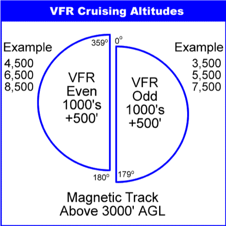

# Preflight Checklist

**The steps every good pilot would do before every flight**

1. Choose route
2. Get Weather briefing
3. Determine Altitude
4. Compute speed, Time and fuel.
5. Weight and balance

## 1. Choose route

1. Get the departure and destination airports information:
2. Runways available (Direction, length)
3. Radio frequencies
	1. Weather frequency (Local weather through radio)
	2. Common frequency (for non-towered airports)
	3. Control tower
4. Distance in between ground control (The controller that direct airplanes on the ground).

## 2. Get weather briefing

1. Looking for overall weather condition. Thunderstorms, tornadoes, tropical storms or any hazardous weather condition around the departure airport (Dep), enroute (En) and destination airport (Des)

2. Overall visibility.
	1. More than 3 statute miles: Visual Flight Rules (VFR)
	2. Less than 3 statute miles: Instrument Flight Rules (IFR)

3. Wind speed and direction in (Dep, En and Des)
4. Wind aloft
5. Temperature aloft (Dep, En and Des)
6. Barometric pressure (Dep, En and Des)

## 3. Determine Altitude

1. Heading in aviation is determined by degrees, 360 being North, 90 is east, 180 is south and 270 is west. For VFR flights above 3 thousand feet, the heading circle is divided into two halves, East and West.

 

2. Another consideration is the wind speed and direction in different flight levels (Wind aloft). Considering point #2.4 We determine the best altitude based on the least head wind or the greatest tail wind from the available altitudes in point #3.1 according to the flight heading.

## 4. Compute speed, time and fuel

1. Considering the wind direction and speed from point #2.3, temperature from point #2.5 and pressure from point #2.6 we calculate the true airspeed.
2. According to point #4.1, we calculate the time based on the distance in point #1.4
3. Based on the airplane fuel consumption and point #4.2 we calculate the fuel needed for the trip plus the reserved fuel for half an hour

## 5. Weight and balance

1. We calculate the overall weight of the airplane and we make sure it does not exceed the maximum takeoff weight, which consists of the following:
	1. Airplane empty weight.
	2. Passengers weights.
	3. Fuel weight.
	4. Luggage weight.
2. After calculating the optimal weight on point #5.1, using the pressure in point #2.6 and temperature on point #2.5 We calculate the runway length required to reach the takeoff speed.
